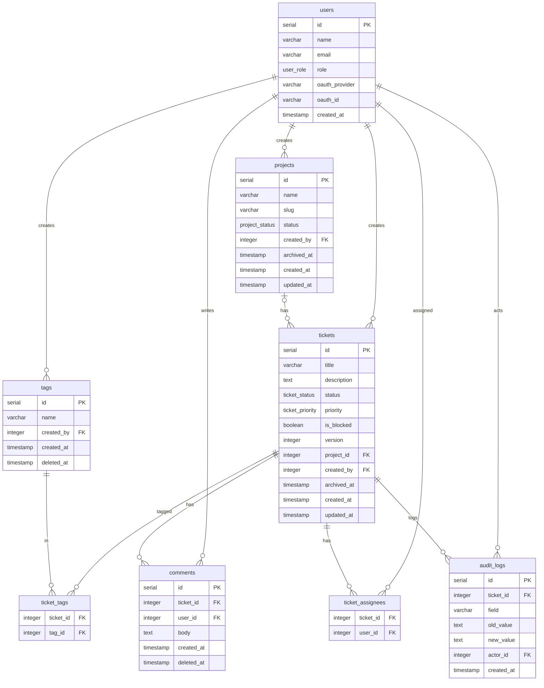

# Base de Datos — Mini Jira

> Fuente de verdad: `src/db/schema.ts`  
> Migraciones de referencia: `drizzle/0000_left_echo.sql` — `drizzle/0006_tags_soft_delete.sql`

---

## Diagrama ERD

---

## Columnas y constraints

### `projects`

| Columna | Tipo | Constraints |
|---------|------|-------------|
| `id` | `serial` | PK |
| `name` | `varchar(255)` | NOT NULL |
| `description` | `text` | nullable |
| `slug` | `varchar(100)` | NOT NULL, UNIQUE |
| `status` | `project_status` | NOT NULL, DEFAULT `'active'` |
| `created_by` | `integer` | FK → users.id, NOT NULL |
| `created_at` | `timestamp with time zone` | NOT NULL, DEFAULT now() |
| `updated_at` | `timestamp with time zone` | NOT NULL, DEFAULT now() |
| `archived_at` | `timestamp with time zone` | nullable |

### `users`

| Columna | Tipo | Constraints |
|---------|------|-------------|
| `id` | `serial` | PK |
| `name` | `varchar(100)` | NOT NULL |
| `email` | `varchar(255)` | NOT NULL, UNIQUE |
| `role` | `user_role` | NOT NULL, DEFAULT `'user'` |
| `oauth_provider` | `varchar(50)` | nullable |
| `oauth_id` | `varchar(255)` | nullable |
| `created_at` | `timestamp with time zone` | NOT NULL, DEFAULT now() |

> ⚠️ Discrepancia: `drizzle/0000_left_echo.sql` creó la tabla `users` con el campo `password_hash varchar(255) NOT NULL`. El schema actual no lo incluye y ninguna migración posterior lo elimina, por lo que la columna puede seguir presente físicamente en la BD aunque Drizzle ya no la gestione.

### `tickets`

| Columna | Tipo | Constraints |
|---------|------|-------------|
| `id` | `serial` | PK |
| `title` | `varchar(255)` | NOT NULL |
| `description` | `text` | nullable |
| `status` | `ticket_status` | NOT NULL, DEFAULT `'todo'` |
| `priority` | `ticket_priority` | NOT NULL |
| `is_blocked` | `boolean` | NOT NULL, DEFAULT `false` |
| `version` | `integer` | NOT NULL, DEFAULT `1` |
| `project_id` | `integer` | FK → projects.id ON DELETE SET NULL, nullable |
| `created_by` | `integer` | FK → users.id, NOT NULL |
| `archived_at` | `timestamp with time zone` | nullable |
| `created_at` | `timestamp with time zone` | NOT NULL, DEFAULT now() |
| `updated_at` | `timestamp with time zone` | NOT NULL, DEFAULT now() |

### `tags`

| Columna | Tipo | Constraints |
|---------|------|-------------|
| `id` | `serial` | PK |
| `name` | `varchar(50)` | NOT NULL, UNIQUE |
| `created_by` | `integer` | FK → users.id, NOT NULL |
| `created_at` | `timestamp with time zone` | NOT NULL, DEFAULT now() |
| `deleted_at` | `timestamp with time zone` | nullable |

### `ticket_assignees`

PK compuesta: `(ticket_id, user_id)`

| Columna | Tipo | Constraints |
|---------|------|-------------|
| `ticket_id` | `integer` | FK → tickets.id ON DELETE CASCADE, NOT NULL |
| `user_id` | `integer` | FK → users.id ON DELETE CASCADE, NOT NULL |

### `ticket_tags`

PK compuesta: `(ticket_id, tag_id)`

| Columna | Tipo | Constraints |
|---------|------|-------------|
| `ticket_id` | `integer` | FK → tickets.id ON DELETE CASCADE, NOT NULL |
| `tag_id` | `integer` | FK → tags.id ON DELETE CASCADE, NOT NULL |

### `comments`

| Columna | Tipo | Constraints |
|---------|------|-------------|
| `id` | `serial` | PK |
| `ticket_id` | `integer` | FK → tickets.id ON DELETE CASCADE, NOT NULL |
| `user_id` | `integer` | FK → users.id, NOT NULL |
| `body` | `text` | NOT NULL |
| `created_at` | `timestamp with time zone` | NOT NULL, DEFAULT now() |
| `deleted_at` | `timestamp with time zone` | nullable |

### `audit_logs`

| Columna | Tipo | Constraints |
|---------|------|-------------|
| `id` | `serial` | PK |
| `ticket_id` | `integer` | FK → tickets.id, NOT NULL |
| `field` | `varchar(50)` | NOT NULL |
| `old_value` | `text` | nullable |
| `new_value` | `text` | nullable |
| `actor_id` | `integer` | FK → users.id, NOT NULL |
| `created_at` | `timestamp with time zone` | NOT NULL, DEFAULT now() |

---

## Decisiones de diseño

### Soft Delete

El proyecto usa dos campos distintos según la semántica del recurso:

- **`archived_at`** — en `tickets` y `projects`. Semántica de "archivado": el recurso sale de la vista activa pero se preserva para cómputo histórico de métricas. Un ticket archivado sigue apareciendo en exportaciones CSV y conteos de auditoría.
- **`deleted_at`** — en `tags` y `comments`. Semántica de "eliminado" desde el punto de vista del usuario: el contenido deja de mostrarse sin implicar archivado para análisis posterior.

Tablas **sin** soft delete:
- `users` — la gestión de cuentas ocurre en el proveedor OAuth externo; no se elimina usuarios desde la app.
- `ticket_assignees`, `ticket_tags` — tablas de unión con `ON DELETE CASCADE`. Cuando el ticket o el usuario padre desaparece, la fila de unión se elimina en cascada automáticamente. No tiene sentido preservar una asignación a un recurso ya eliminado.
- `audit_logs` — tabla append-only inmutable; la eliminación de registros de auditoría contradiría el propósito de la tabla.

### Optimistic Locking (campo `version`)

El campo `version integer NOT NULL DEFAULT 1` en `tickets` fue añadido en `drizzle/0001_open_clea.sql`.

Funcionamiento: cada `PATCH` que modifica un ticket incluye el `version` que el cliente conoce en la cláusula `WHERE id=:id AND version=:v`. Si el UPDATE devuelve cero filas, significa que otro usuario ya guardó (y la versión en BD avanzó), por lo que la API responde **409 Conflict**. Cuando el UPDATE tiene éxito, se incrementa `version` a `version + 1` en el `SET`.

La estrategia elegida es **Optimistic Locking**: no existen tablas de bloqueo (`ticket_locks`) ni `SELECT FOR UPDATE`. Esto maximiza la concurrencia en escenarios de baja contención (el caso típico en un tablero Kanban) a costa de requerir manejo de conflicto en el cliente cuando dos usuarios editan el mismo ticket simultáneamente.

### AuditLog inmutable

La tabla `audit_logs` no tiene campos `updated_at` ni `deleted_at`. El comentario en `schema.ts` lo declara explícitamente: `// Immutable — no UPDATE or DELETE ever issued against this table`.

Esta garantía arquitectónica establece que cada registro de cambio de `status` o `priority` es permanente y no puede ser alterado después de ser escrito. Cualquier `UPDATE` o `DELETE` contra esta tabla sería un defecto, no una feature.

Índices disponibles para las consultas frecuentes de auditoría:
- `audit_logs_ticket_id_idx` — `GET /tickets/:id/audit` (listar todos los cambios de un ticket)
- `audit_logs_ticket_id_field_idx` — filtrar por campo específico dentro de un ticket (ej. solo cambios de `status`)
- `audit_logs_actor_id_idx` — listar todas las acciones de un usuario concreto
- `audit_logs_created_at_idx` — consultas por rango de fechas en el dashboard de métricas

### Enums de PostgreSQL

Los enums definidos y sus valores permitidos:

| Enum | Valores | Añadido en |
|------|---------|------------|
| `user_role` | `'admin'`, `'user'` | 0000 |
| `ticket_status` | `'todo'`, `'in_progress'`, `'review'`, `'done'` | 0000 + `'review'` en 0004 |
| `ticket_priority` | `'high'`, `'medium'`, `'low'` | 0000 |
| `project_status` | `'active'`, `'archived'` | 0002 |

Razones para usar enums de PG en lugar de `varchar` con check constraints:
1. Los enums son tipos de primera clase en PostgreSQL: Drizzle los expone como tipos TypeScript nativos, eliminando la necesidad de validación manual en la capa de aplicación.
2. Se almacenan como enteros internamente, lo que reduce el espacio en disco y mejora el rendimiento de índices y comparaciones frente a strings.
3. Un `varchar` con check constraint puede ser ignorado en bulk inserts con `ON CONFLICT DO NOTHING`; un enum falla en el momento del cast, antes de llegar al constraint.
