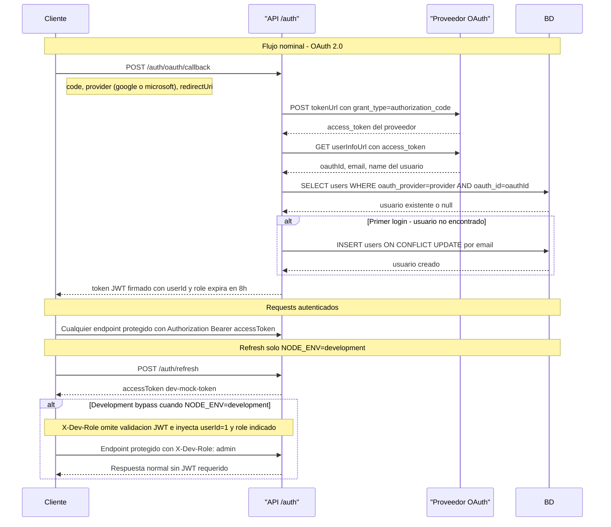
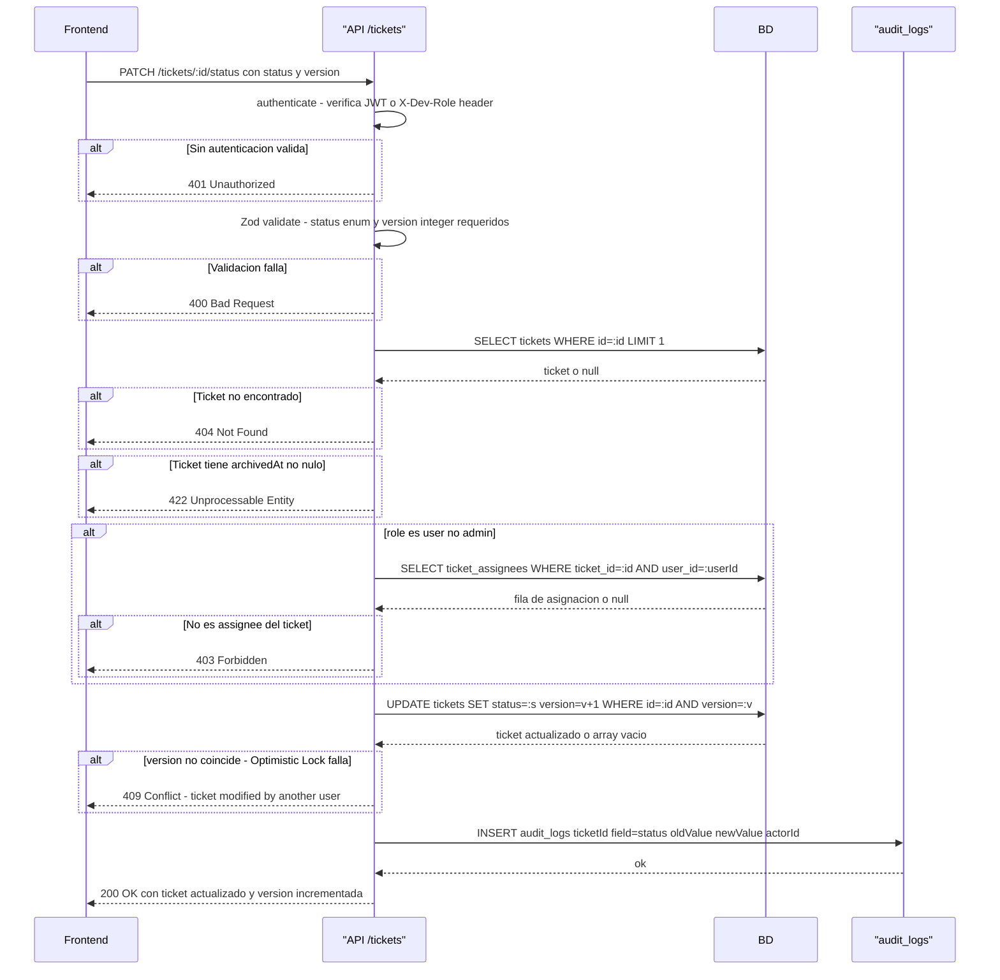
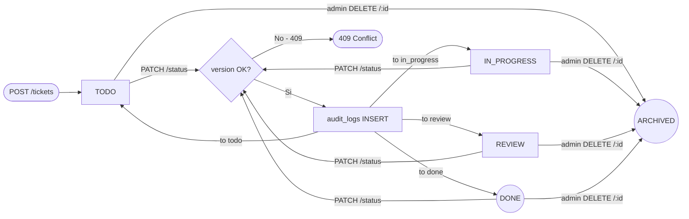

# Diagramas Técnicos — Mini Jira

> Fuentes: `docs/Base-specs-backend/specs.md`, `docs/Base-specs-backend/api-contract.md`, `src/routes/auth.ts`, `src/routes/tickets.ts`, `src/routes/audit.ts`

---

## Diagrama 1: Flujo de autenticación JWT

> ⚠️ No documentado en las fuentes: el flujo de refresh con `refreshToken` vía httpOnly cookie en producción no está implementado en `src/routes/auth.ts`. El endpoint `POST /auth/refresh` solo existe en `NODE_ENV=development` y devuelve un token mock. No existe un flujo de refresh real para producción en los archivos leídos.

---

## Diagrama 2: Mover ticket entre columnas (Optimistic Locking)

---

## Diagrama 3: Ciclo de vida de un ticket

> **Nota:** El flag `is_blocked` se gestiona via `PATCH /tickets/:id` con el campo `isBlocked: boolean`. No cambia la columna del ticket ni crea una transición de estado separada. Solo activa un badge visual en la UI sin alterar el campo `status`.
